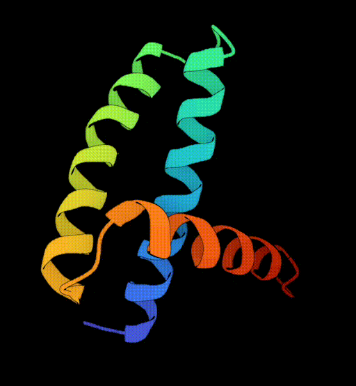
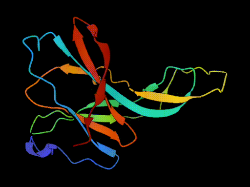
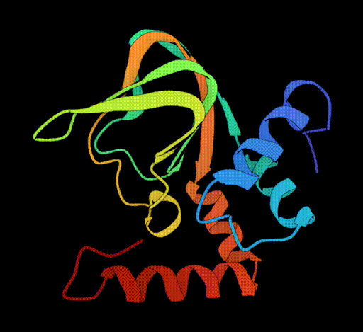
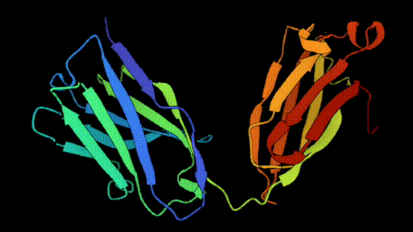
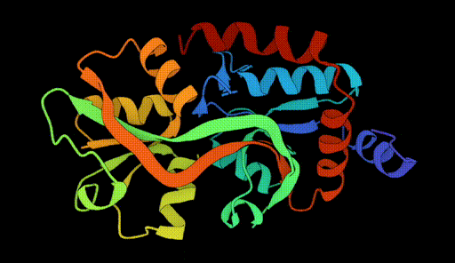
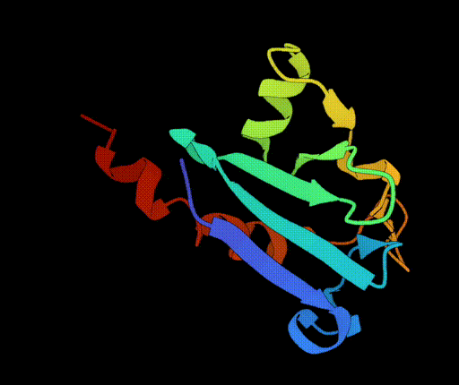
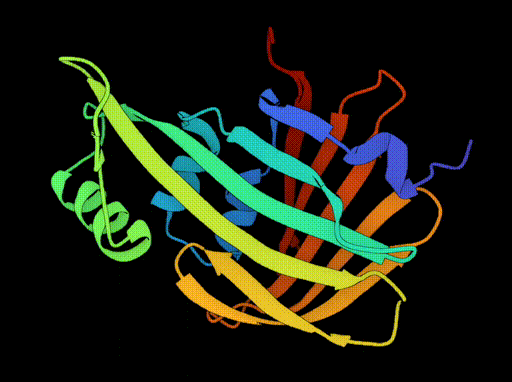

<h1 align='center'>DyneTrion: Spatiotemporally Coherent Generative Emulation of Protein Dynamics Across Timescales</h1>

<div align='center'>
    Kaihui Cheng<sup>1,2*</sup>&emsp;
    Zhiqiang Cai<sup>2*</sup>&emsp;
    Peng Tu<sup>2</sup>&emsp;
    Yisong Yao<sup>2</sup>&emsp;
</div>
<div align='center'>
    Limei Han<sup>1,2</sup>&emsp;
    Libo Wu<sup>1</sup>&emsp;
    <a href='https://sites.google.com/site/zhusiyucs/home/' target='_blank'>Siyu Zhu</a><sup>2†</sup>&emsp;
    Tzuhsiung Yang†<sup>2</sup>&emsp;
    Yuan Qi<sup>2†</sup>&emsp;
</div>

<div align='center'>
    <sup>1</sup>Fudan University&emsp;
    <sup>2</sup>Shanghai Academy of AI for Science&emsp;
</div>

<div align='center'>
    <sup>*</sup>Equal Contribution&emsp;
    <sup>†</sup>Corresponding Author
</div>

<table class="center">
  <tr>
    <td style="text-align: center"><b>1ail_A</b></td>
    <td style="text-align: center"><b>1ifg_A</b></td>
    <td style="text-align: center"><b>2kxl_A</b></td>
    <td style="text-align: center"><b>2rcs_H</b></td>
  </tr>
  <tr>
    <td style="text-align: center">
      <a target="_blank" href="./assets/1ail_A.gif">
        
      </a>
    </td>
    <td style="text-align: center">
      <a target="_blank" href="./assets/1ifg_A.gif">
        
      </a>
    </td>
    <td style="text-align: center">
      <a target="_blank" href="./assets/2kxl_A.gif">
        
      </a>
    </td>
    <td style="text-align: center">
      <a target="_blank" href="./assets/2rcs_H.gif">
        
      </a>
    </td>
  </tr>

  <tr>
    <td style="text-align: center"><b>5b3k</b></td>
    <td style="text-align: center"><b>7ejg</b></td>
    <td style="text-align: center"><b>7n0j_E</b></td>
    <td style="text-align: center"><b>7vsx</b></td>
  </tr>
  <tr>
    <td style="text-align: center">
      <a target="_blank" href="./assets/5b3k.gif">
        
      </a>
    </td>
    <td style="text-align: center">
      <a target="_blank" href="./assets/7ejg.gif">
        
      </a>
    </td>
    <td style="text-align: center">
      <a target="_blank" href="./assets/7n0j_E.gif">
        
      </a>
    </td>
    <td style="text-align: center">
      <a target="_blank" href="./assets/7vsx.gif">
        
      </a>
    </td>
  </tr>
</table>


## 📅️ Roadmap
| Status | Milestone                                             |    ETA     |
| :----: | :---------------------------------------------------- | :--------: |
|   ✅   | Inference code and pretrained checkpoints released    | 2025-12-22 |
|   🚀   | Training code release                                 |    TBD     |
|   🚀   | Accelerate inference performance                     |    TBD     |


## ⭐️ Source Data
DynamicPDB (https://github.com/fudan-generative-vision/dynamicPDB): a large-scale dataset that augments existing static 3D protein structural databases (e.g., PDB) with dynamic information and additional physical properties. It contains approximately 12.6k filtered proteins, each subjected to all-atom molecular dynamics (MD) simulations to capture conformational changes.


## 🛠️ Installation
```bash
# Create virtual environment (Python 3.10.12 is recommended)
python -m venv .venv
source .venv/bin/activate

# Install PyTorch (CUDA 12.4)
pip install torch==2.4.0 --index-url https://download.pytorch.org/whl/cu124

# Install other dependencies
pip install -r requirements.txt
```


## 📥 Download Pretrained Models & Pre-Processed Data
Pretrained weights for DyneTrion are available on [Hugging Face](https://huggingface.co/fudan-generative-ai/dynamicPDB/tree/main). The pre-processed test data can be found in the dynamicPDB dataset repository, [DyneTrion-test-data](https://huggingface.co/datasets/fudan-generative-ai/dynamicPDB).

## ▶️ Inference

Run inference using:

```bash
bash inference.sh
```

- Model checkpoint: step_400000.pth
- Input CSV: datasets/inference/inference_data.csv
- Frame number: n_frame = 16
- Motion number: n_motion = 2
- Frame sampling step: sample_step = 40
- Extrapolation time: extrapolation_time = 16
- Noise scale: noise_scale = 1.0

Inference results will be saved to save_root (default: ./test/inference/).

